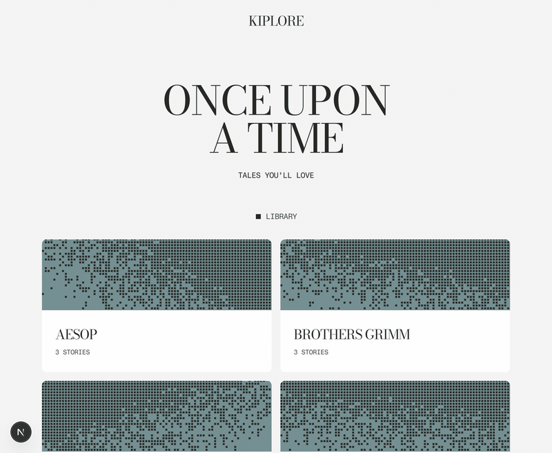

<h1 align="center">Kiplore</h1>

<p align="center">
  A voice application that reads folk tales aloud to a child and answers their questions
  in the middle of the story.
</p>

<p align="center">
  
  
  
  
  
</p>

<p align="center">
  
</p>

## Features

- **Interrupt with your voice.** Speaking ducks the narration immediately and stops it on
  the first interim transcript.
- **Answers that cannot spoil the story.** The model sees only the text narrated so far.
- **Captions derived from the audio.** Character level timings from the synthesiser are
  grouped into sentences, so the caption matches what is being spoken.
- **Pause, resume and ten second seeks**, applied by the agent and reflected to the client.
- **Renders are cached** in object storage under a hash of every input that shaped them,
  and quality checked before they are stored.
- **One JSON log stream per session**, carrying time to first audio, barge-in latency and
  answer turnaround.

## How it works

The browser and a Python worker meet in a LiveKit room. The worker is the narrator: it
publishes an audio track, streams synthesised speech into it, listens to the child's
microphone, and answers when spoken to.

```
web (Next.js)  ──token──▶  LiveKit room  ◀──audio + data──  agent (Python)
                                                              │
                                ElevenLabs ── narration ──────┤
                                Deepgram ──── transcription ──┤
                                OpenAI ────── answers ────────┤
                                Cloudflare R2 ─ render cache ─┘
```

Deepgram transcribes the microphone continuously. Frame energy ducks the narration as soon
as speech is detected, and the first interim transcript stops playback. The question then
goes to OpenAI with the story text heard so far, the reply is synthesised in the same
voice, and playback resumes from the start of the interrupted sentence.

## Getting started

Requires Python 3.13 with [uv](https://docs.astral.sh/uv/), Node.js 24, and accounts for
LiveKit, ElevenLabs, Deepgram, OpenAI and Cloudflare R2.

| Variable | Required by | Purpose |
| --- | --- | --- |
| `LIVEKIT_URL`, `LIVEKIT_API_KEY`, `LIVEKIT_API_SECRET` | agent, web | Room connection and token signing |
| `ELEVENLABS_API_KEY` | agent | Speech synthesis |
| `DEEPGRAM_API_KEY` | agent | Transcription |
| `OPENAI_API_KEY` | agent | Answer generation |
| `R2_ACCOUNT_ID`, `R2_ACCESS_KEY_ID`, `R2_SECRET_ACCESS_KEY`, `R2_BUCKET` | agent | Render cache |

Put all of these in `agent/.env`, and the three `LIVEKIT_` values in `web/.env.local`. Then
run the worker and the web application in separate terminals:

```bash
cd agent && uv run python -m narrator.main dev
```

```bash
cd web && npm install && npm run dev
```

The application is available at http://localhost:3000. The first playback of a story
synthesises it, which takes a few seconds and consumes ElevenLabs credits. Later playbacks
are served from the cache.

## Tests

```bash
cd agent && uv run pytest
```

```bash
cd web && npm test
```

Neither needs a network, an API key or an audio device. GitHub Actions runs both on every
push, along with ruff, eslint and a production build.

## Story format

Each story is one JSON file with a script of seven chunks. Collections are directories
under `library/`.

```json
{
  "id": "the-tortoise-and-the-hare",
  "title": "The Tortoise and the Hare",
  "blurb": "The fastest animal in the wood takes a nap. That is his mistake.",
  "script": ["[warmly] Long, long ago…", "..."]
}
```

Bracketed tags are [ElevenLabs v3 audio tags](https://elevenlabs.io/docs/best-practices/prompting/eleven-v3),
removed before any text reaches the screen. When editing a script: v3 is the only model
that supports tags, the limit is 5,000 characters per story, and `[short pause]` works
while SSML break tags do not.

Twelve public domain stories are included, from Aesop, the Brothers Grimm, Hans Andersen
and Kipling's *Just So Stories*.

## Project layout

```
agent/src/narrator/    the LiveKit worker: synthesis, alignment, listening,
                       answering, caching, playback and reconnect handling
agent/tests/           unit tests, no network and no keys
agent/Dockerfile       how the worker ships, since LiveKit runs it as a container
web/                   Next.js App Router client and the token endpoint
library/               story content as JSON, one directory per collection
```

This is a single user demonstration with no authentication or persistence. The token
endpoint returns 403 outside development.

## Licence

[PolyForm Noncommercial 1.0.0](LICENSE.md), SPDX `PolyForm-Noncommercial-1.0.0`.
Copyright 2026 Sarathi Thirumalai Soundararajan.

Read it, study it, run it for yourself. Any commercial use needs a separate
licence from me. The twelve stories under `library/` are public domain and the
licence does not affect them.
